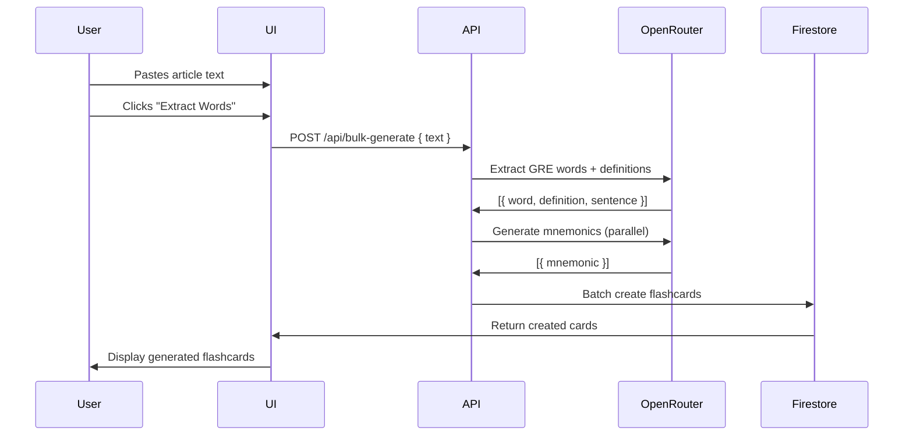

# Magic Import Feature - Technical Specification

## Overview

Allow users to paste paragraphs from articles (e.g., Economist, NYT) and automatically generate 5-10 GRE-level flashcards using OpenRouter AI.

## User Flow



## API Design

### Endpoint: `POST /api/bulk-generate`

**Request:**
```typescript
interface BulkGenerateRequest {
  text: string;        // Raw article text (max 5000 chars)
  maxCards?: number;   // Optional limit (default: 10)
}
```

**Response:**
```typescript
interface BulkGenerateResponse {
  cards: Array<{
    id: string;
    word: string;
    definition: string;
    mnemonic?: string;
    sentence?: string;
  }>;
  extractedCount: number;
  skippedCount: number;
}

interface ErrorResponse {
  error: string;
}
```

## OpenRouter Prompt Strategy

### Step 1: Extract GRE Words
```system
You are a GRE vocabulary expert. Analyze the following text and identify 5-10 advanced GRE-level words.
For each word, provide: the word, its definition in context, and an example sentence from the text.
Respond ONLY with valid JSON array:
[{"word": "...", "definition": "...", "context": "..."}]
```

### Step 2: Generate Mnemonics (Parallel)
```system
For the word "{word}" (definition: "{definition}"), provide a memorable mnemonic and example sentence.
Respond ONLY with JSON: {"mnemonic": "...", "sentence": "..."}
```

## UI Components

### New Component: `BulkImportModal`

**States:**
1. **Input** - Text area for pasting article
2. **Processing** - Progress indicator with extracted words count
3. **Review** - List of extracted cards with edit capability
4. **Complete** - Success message with "View Cards" action

**Location:** Dashboard page, near "Add New Card" button

## Database Schema

No schema changes needed - reuses existing `flashcards` collection:

```typescript
interface Flashcard {
  id: string;
  word: string;
  definition: string;
  mnemonic?: string;
  sentence?: string;
  mastered: boolean;
  createdAt: Timestamp;
  userId: string;
  source?: 'manual' | 'bulk-import';  // New field
}
```

## Security Considerations

1. **Input Validation:** Max 5000 characters, sanitize HTML
2. **Rate Limiting:** Existing 10 req/min applies
3. **Cost Control:** Limit to 10 cards per import, add pricing guard
4. **Content Filtering:** Skip inappropriate words

## Error Handling

| Error | User Message |
|-------|--------------|
| Text too short (<50 chars) | "Please paste a longer passage (at least 50 characters)" |
| No GRE words found | "No GRE-level vocabulary found. Try a more academic article." |
| API timeout | "Processing took too long. Try a shorter passage." |
| Rate limit hit | "Too many requests. Please wait a moment." |

## Implementation Priority

1. Create `/api/bulk-generate` endpoint
2. Add `BulkImportModal` component to dashboard
3. Update dashboard to show import button
4. Add `source` field tracking

## Files to Modify/Create

- `src/app/api/bulk-generate/route.ts` (new)
- `src/components/BulkImportModal.tsx` (new)
- `src/app/dashboard/page.tsx` (add button)
- `src/lib/useFlashcards.ts` (add bulk method)

## Estimated Complexity

- **API:** 2-3 hours
- **UI:** 3-4 hours  
- **Testing:** 1-2 hours
- **Total:** 6-9 hours
